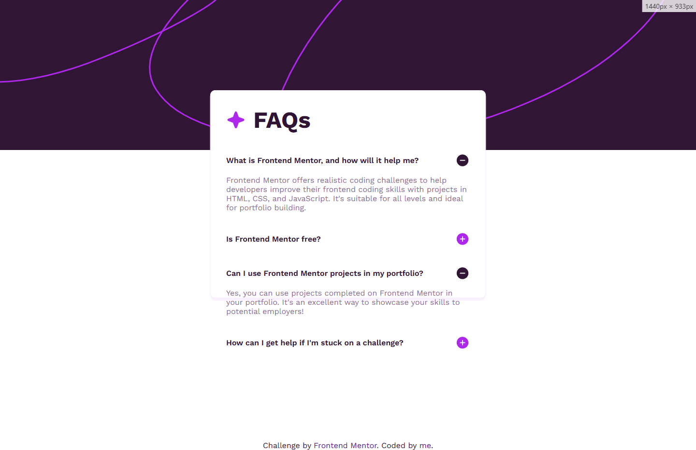
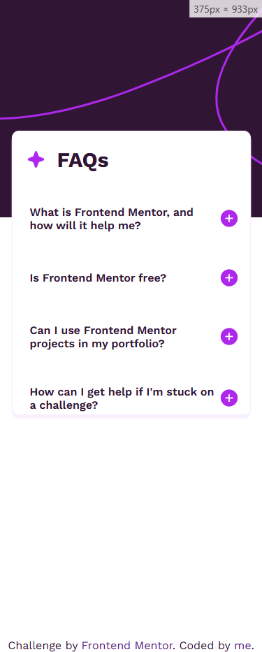

# Hellooo
This is me doing another Frontend Mentor challenge!

## Screenshots
### Desktop view:

### Mobile view:

## Extra info
As the challenge sugested, when you pass the mouse on a question, it turns purple, i just couldnt get it into a screenshot without taking one of my whole desktop.

Also, i'm happy that i managed to do all that in a single afternoon, without getting angry or distrated. I know it isn't much but it's a move foward for me.